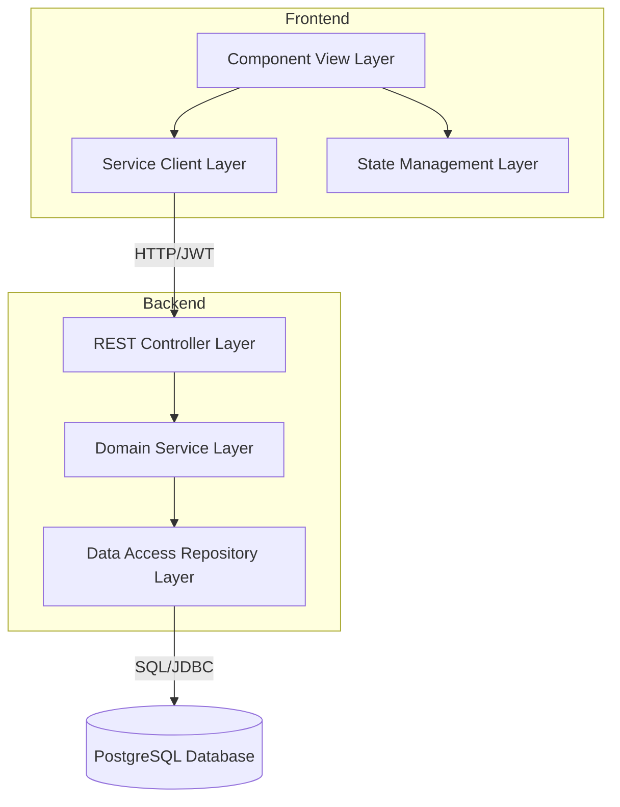
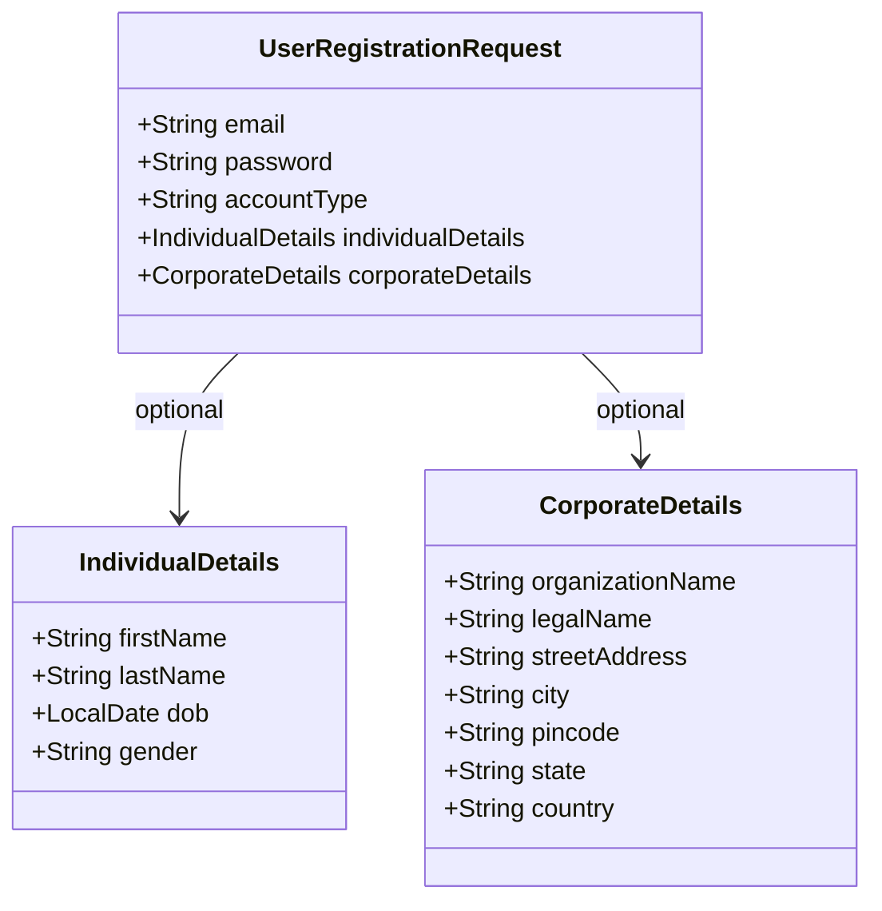
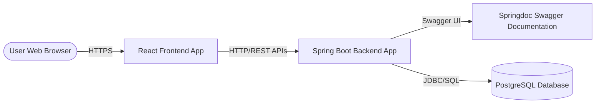

# Architecture Spine — ExceptionPro Authentication & Profiles

## Design Paradigm

This feature is designed using a **Layered Monolith Paradigm** on the backend and a **Modular Component-Service Paradigm** on the frontend. The layers are structured as follows:

*   **Backend Layers:**
    *   **Presentation (Controller) Layer:** Exposes REST endpoints documented via Swagger. Directs incoming HTTP requests to the Service Layer. Never contains business logic.
    *   **Domain Service Layer:** Implements business validation, password hashing, and user role evaluation. Orchestrates model mutations.
    *   **Data Access (Repository) Layer:** Utilizes Spring Data JPA interfaces for safe, transaction-bound queries against the PostgreSQL database.
*   **Frontend Layers:**
    *   **Component (View) Layer:** React components written in TypeScript. Styling is strictly defined in separate Vanilla CSS files matching component names.
    *   **Service (API Client) Layer:** Encapsulates network operations using `fetch` or `axios`, converting response streams to typed interfaces.
    *   **State Management Layer:** Manages global authentication session tokens and profile states via React Context or a lightweight store (Zustand).



## Invariants & Rules

### AD-1 — REST Security Boundary
*   **Binds:** `FR-1`, `FR-12`
*   **Prevents:** Unauthorized access to admin functionality and cross-tenant profile snooping.
*   **Rule:** The Java Spring Boot backend must secure all API endpoints using Spring Security. Admin endpoints (e.g. `/api/admin/**`) must require the `ADMIN` role. Regular user profile endpoints (e.g. `/api/users/me`) must require the `USER` role. Authenticated states must be established via a stateless JWT token.

### AD-2 — Mandatory Social Login Profile Completion Redirect
*   **Binds:** `FR-3`
*   **Prevents:** Social sign-in accounts bypassing registration constraints (account type, addresses).
*   **Rule:** When a user authenticates via Google/Facebook for the first time, the backend creates a user record with a null `accountType` and returns a JWT with restricted profile-completion scope. The React frontend Router must intercept this token, block access to main application routes, and force redirection to the `/profile-completion` page. Standard authorization scopes are only granted once the profile is fully completed and persisted.

### AD-3 — Immutable Identity Fields
*   **Binds:** `FR-10`
*   **Prevents:** Data inconsistency and account classification hijacking.
*   **Rule:** The `email` (acting as the system-wide unique identifier/username) and `accountType` fields are immutable once submitted during signup or first-time social login completion. The backend `PUT /api/users/me` endpoint must ignore or reject modifications to these fields, and the React profile page must render them in a read-only state.

### AD-4 — Backend-Only Admin Administration
*   **Binds:** `FR-11`
*   **Prevents:** Malicious actors attempting to exploit frontend reset flows to take over administrative accounts.
*   **Rule:** Administrative credentials and password states cannot be modified or generated via public REST API endpoints or frontend screens. The backend must seed the default admin account using Flyway database migrations. Password resets for administrative accounts must be performed exclusively via direct database updates or backend shell scripts.

### AD-5 — DTO Validation and Form Polymorphism
*   **Binds:** `FR-6`
*   **Prevents:** Invalid data states (e.g., individual profiles possessing company contact attributes, or buyers lacking legal organization names) from polluting the database.
*   **Rule:** The registration controller must validate inputs against account-type specific constraints. The frontend must validate fields based on the selected dropdown value before sending the registration payload.



## Consistency Conventions

| Concern | Convention |
| --- | --- |
| **Naming Conventions** | Java: `CamelCase` for classes/interfaces, `camelCase` for variables/methods, `UPPER_SNAKE_CASE` for constants.<br>React: `PascalCase` for component files (`LoginForm.tsx`), `camelCase` for utilities. CSS files named identically to their component (`LoginForm.css`). |
| **Data & Formats** | User IDs: UUIDv4 representation mapped as String/UUID in backend and DB. Date of Birth: ISO 8601 YYYY-MM-DD.<br>Error response envelope: `{ "status": 400, "message": "Passwords do not match", "timestamp": "2026-07-31T12:00:00Z", "errors": [] }` |
| **State & Cross-Cutting** | Password Hashing: BCrypt strength 12.<br>Logging: Standard SLF4J (Logback) on backend, structured as `[Timestamp] [Thread] [Level] [Class] - Message`. |

## Stack

| Name | Version |
| --- | --- |
| **Java SDK** | 21 |
| **Spring Boot** | 3.3.x |
| **Spring Security** | 6.3.x |
| **PostgreSQL** | 16 |
| **Flyway** | 10.x |
| **React** | 18.x |
| **TypeScript** | 5.x |
| **Springdoc OpenAPI (Swagger)**| 2.5.0 |

## Structural Seed

### Source Code Directory Layout

```text
{project-root}/
  backend/
    src/main/java/com/exceptionpro/
      config/             # Spring Security, OAuth2, and Swagger configuration
      controller/         # REST API Controllers (AuthController, ProfileController, AdminController)
      dto/                # Request/Response payloads (UserRegistrationRequest, UserProfileResponse)
      entity/             # JPA Entities mapped to PostgreSQL (User, IndividualProfile, CorporateProfile)
      repository/         # Spring Data JPA Repository interfaces
      service/            # Business services (AuthService, UserService, AdminService)
    src/main/resources/
      db/migration/       # Flyway migration scripts (V1__init_schema.sql, V2__seed_admin.sql)
      application.yml     # Configuration values (database credentials, JWT secrets, OAuth2 clients)
  frontend/
    public/
    src/
      assets/             # Images, logos, etc.
      components/         # Reusable React components (LoginForm.tsx, RegisterForm.tsx, CSS files)
      context/            # React AuthContext for managing user tokens and session states
      pages/              # Main view surfaces (Login.tsx, Register.tsx, Profile.tsx, AdminDashboard.tsx)
      services/           # API integration clients (api.ts, authService.ts)
      App.tsx             # Route definitions and Router setup
      index.tsx           # Application entry point
      index.css           # Global CSS variables and variables for design system
```

### System Container Topology



## Capability → Architecture Map

| Capability / Area | Lives in | Governed by |
| --- | --- | --- |
| Standard Credentials Login (`FR-1`) | `AuthController.java`, `LoginForm.tsx` | `AD-1`, `AD-3` |
| Social Login (`FR-2`, `FR-3`) | `config/SecurityConfig.java`, `App.tsx` | `AD-1`, `AD-2` |
| Password Recovery (`FR-4`) | `UserService.java`, `PasswordResetController.java` | `AD-1`, `AD-4` |
| Cancel Navigation (`FR-5`) | `LoginForm.tsx`, `App.tsx` | Frontend Routing |
| Poly-Form Registration (`FR-6`, `FR-7`, `FR-9`) | `RegisterForm.tsx`, `UserRegistrationRequest.java` | `AD-3`, `AD-5` |
| Email Uniqueness Validation (`FR-8`) | `UserRepository.java`, `UserService.java` | DB Unique Constraints |
| Editable Profile View (`FR-10`) | `Profile.tsx`, `ProfileController.java` | `AD-1`, `AD-3` |
| Backend-Only Admin Seeding (`FR-11`) | `db/migration/V2__seed_admin.sql` | `AD-4` |
| React Admin Dashboard Directory (`FR-12`) | `AdminDashboard.tsx`, `AdminController.java` | `AD-1`, `AD-4` |

## Deferred
*   **SMTP Mail Server Configuration:** The production SMTP relay details and templates for Forgotten Password email dispatching are deferred to the deployment infrastructure phase.
*   **OAuth2 Secrets Management:** Client IDs and Client Secrets for Google and Facebook OAuth2 providers are deferred from code; they must be supplied at runtime via environment variables (`SPRING_SECURITY_OAUTH2_CLIENT_REGISTRATION_GOOGLE_CLIENT_SECRET`, etc.).
*   **Production Hosting Topology:** Details regarding containerization (Docker/Kubernetes) and secure SSL/TLS termination proxies (Nginx/Cloudflare) are deferred to the infrastructure release sprint.
